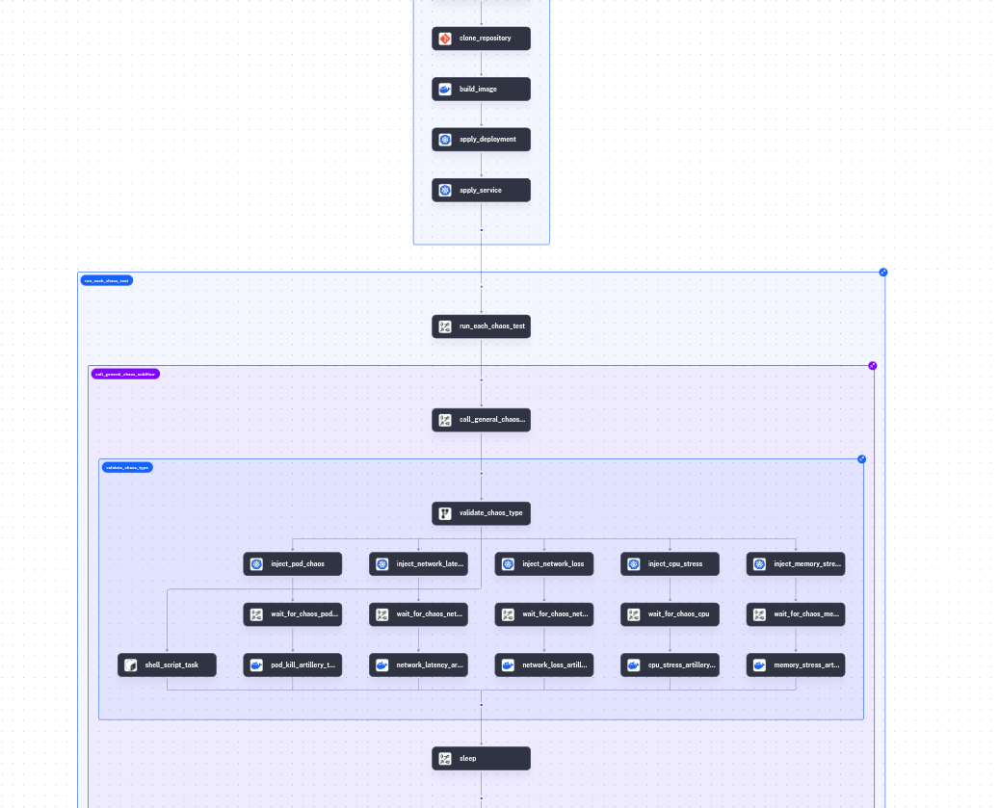

# A-CERT: Advanced Chaos Engineering Resilience Testing

[](https://kestra.io)
[](https://docker.com)
[](https://kubernetes.io)
[](https://chaos-mesh.org)



## 📋 Table of Contents

1. [Overview](#-overview)
2. [How It Works](#-how-it-works)
3. [Features](#-features)
4. [Prerequisites](#-prerequisites)
5. [Kestra Plugins](#-kestra-plugins)
6. [Workflow Configuration](#-workflow-configuration)
7. [Chaos Test Types](#-chaos-test-types)
8. [Input Parameters](#-input-parameters)
9. [Usage](#-usage)
10. [Results & Evaluation](#-results--evaluation)
11. [Troubleshooting](#-troubleshooting)
12. [Contributing](#-contributing)

## 🚀 Overview

A-CERT (Advanced Chaos Engineering Resilience Testing) is a sophisticated chaos testing tool built on Kestra workflows that automates the entire process of chaos engineering for microservices. It provides a comprehensive solution for testing application resilience by introducing controlled failures and measuring system behavior under stress.

The tool combines **Chaos Mesh** for chaos injection, **Artillery** for load testing, and **Kubernetes** for container orchestration to deliver enterprise-grade chaos testing capabilities.

## 🔄 How It Works

A-CERT follows a structured approach to chaos testing:

1. **Source Code Acquisition**: Clones your microservice repository from GitHub
2. **Container Building**: Builds a Docker image from your application
3. **Registry Push**: Pushes the image to Docker Hub for deployment
4. **Kubernetes Deployment**: Deploys your microservice to a Kubernetes cluster
5. **Service Exposure**: Creates Kubernetes services for external access
6. **Baseline Testing**: Runs initial load tests to establish performance baselines
7. **Chaos Injection**: Systematically introduces various types of failures
8. **Performance Monitoring**: Continuously monitors application behavior during chaos
9. **Results Analysis**: Evaluates test results against predefined thresholds
10. **Pass/Fail Determination**: Provides clear certification of application resilience

## ✨ Features

- **Multi-Type Chaos Testing**: CPU stress, memory stress, network latency, packet loss, and pod killing
- **Configurable Test Modes**: Support for different targeting modes (one, all, fixed, percentage-based)
- **Automated CI/CD Integration**: Seamless integration with existing development workflows
- **Real-time Performance Monitoring**: Live tracking of response times and error rates
- **Customizable Thresholds**: Define your own acceptance criteria for resilience
- **Comprehensive Reporting**: Detailed test results with pass/fail analysis
- **Scalable Load Testing**: Configurable virtual user simulation with Artillery
- **Cloud-Native Architecture**: Built for Kubernetes environments

## 📋 Prerequisites

### Infrastructure Requirements

- **Kubernetes Cluster** (v1.19+)
- **Chaos Mesh** installed on the cluster
- **Docker Hub Account** for image registry
- **Kestra Instance** (v0.15+)

### Application Requirements

- Microservice with **Dockerfile** in repository root
- **Health check endpoint** (`/health`) for readiness probes
- Application listening on **port 3000**
- **GitHub repository** with public access

## 🔧 Kestra Plugins

A-CERT utilizes the following Kestra plugins:

### Core Plugins

- `io.kestra.plugin.core.flow.WorkingDirectory` - Workspace management
- `io.kestra.plugin.core.flow.ForEach` - Iterative task execution
- `io.kestra.plugin.core.flow.Subflow` - Workflow composition
- `io.kestra.plugin.core.flow.Switch` - Conditional execution
- `io.kestra.plugin.core.flow.Sleep` - Timing control

### Integration Plugins

- `io.kestra.plugin.git.Clone` - Git repository operations
- `io.kestra.plugin.docker.Build` - Docker image building
- `io.kestra.plugin.docker.Run` - Container execution
- `io.kestra.plugin.kubernetes.kubectl.Apply` - Kubernetes resource management
- `io.kestra.plugin.scripts.shell.Commands` - Shell script execution
- `io.kestra.plugin.scripts.runner.docker.Docker` - Containerized script execution

## ⚙️ Workflow Configuration

The tool consists of two main workflows:

### 1. Main Workflow (`acert`)

- **Namespace**: `github.clone`
- **Purpose**: Orchestrates the complete chaos testing pipeline
- **Key Tasks**: Repository cloning, image building, deployment, test execution

### 2. Chaos Test Workflow (`general-chaos-test`)

- **Namespace**: `acert`
- **Purpose**: Executes individual chaos experiments
- **Key Tasks**: Chaos injection, load testing, result collection

## 🌪️ Chaos Test Types

### 1. **CPU Stress Testing**

- Injects high CPU load on target pods
- Configurable worker threads and load percentage
- Tests application behavior under compute pressure

### 2. **Memory Stress Testing**

- Creates memory pressure on target containers
- Configurable memory size and worker count
- Validates memory management and garbage collection

### 3. **Network Latency Testing**

- Introduces artificial network delays
- Configurable latency, jitter, and correlation
- Tests timeout handling and user experience

### 4. **Network Loss Testing**

- Simulates packet loss scenarios
- Configurable loss percentage and correlation
- Validates retry mechanisms and error handling

### 5. **Pod Kill Testing**

- Terminates pods to simulate failures
- Tests service recovery and failover mechanisms
- Validates high availability configurations

## 📝 Input Parameters

### Required Parameters

| Parameter             | Type        | Description              |
| --------------------- | ----------- | ------------------------ |
| `github_repo_url`     | STRING      | GitHub repository URL    |
| `docker_hub_username` | STRING      | Docker Hub username      |
| `docker_hub_password` | STRING      | Docker Hub password      |
| `chaos_test`          | MULTISELECT | Chaos tests to execute   |
| `tests_duration`      | INT         | Test duration in seconds |
| `chaos_mode`          | SELECT      | Test targeting mode      |

### Optional Parameters

| Parameter                 | Type   | Description               | Default |
| ------------------------- | ------ | ------------------------- | ------- |
| `network_latency_ms`      | INT    | Network latency in ms     | 1000    |
| `network_loss_percent`    | INT    | Packet loss percentage    | 25      |
| `memory_size`             | STRING | Memory stress size        | "128MB" |
| `cpu_workers`             | INT    | CPU stress workers        | 1       |
| `threshold_error_rate`    | FLOAT  | Max acceptable error rate | 0.05    |
| `threshold_response_time` | INT    | Max response time in ms   | 500     |
| `arrival_rate`            | INT    | Virtual users per second  | 10      |

### Chaos Modes

- **one**: Target single pod
- **all**: Target all pods
- **fixed**: Target specific number of pods
- **fixed-percent**: Target percentage of pods
- **random-max-percent**: Random percentage up to maximum

## 🚀 Usage

### 1. Basic Execution

```yaml
# Trigger the main workflow with minimal configuration
inputs:
  github_repo_url: "https://github.com/your-org/your-microservice.git"
  docker_hub_username: "your-username"
  docker_hub_password: "your-password"
  chaos_test: ["pod_kill", "cpu_stress"]
  tests_duration: 60
  chaos_mode: "one"
```

### 2. Advanced Configuration

```yaml
# Comprehensive chaos testing configuration
inputs:
  github_repo_url: "https://github.com/your-org/your-microservice.git"
  docker_hub_username: "your-username"
  docker_hub_password: "your-password"
  chaos_test: ["cpu_stress", "memory_stress", "network_latency", "pod_kill"]
  tests_duration: 120
  chaos_mode: "fixed-percent"
  chaos_mode_value: "50"
  cpu_workers: 4
  cpu_load: 80
  memory_size: "256MB"
  network_latency_ms: 500
  threshold_error_rate: 0.02
  threshold_response_time: 300
  arrival_rate: 20
```

### 3. CI/CD Integration

```yaml
# Example GitHub Actions integration
- name: Run Chaos Tests
  run: |
    curl -X POST "${KESTRA_URL}/api/v1/executions/acert/github.clone" \
      -H "Content-Type: application/json" \
      -d @chaos-test-config.json
```

## 📊 Results & Evaluation

### Performance Metrics

A-CERT evaluates the following metrics:

- **Response Time**: Average, P95, and P99 response times
- **Error Rate**: Percentage of failed requests
- **Success Rate**: Percentage of successful responses
- **Throughput**: Requests per second handled
- **Availability**: Service uptime during chaos

### Pass/Fail Criteria

Tests are evaluated against configurable thresholds:

```bash
✅ PASSED: Response time < 500ms AND Error rate < 5%
❌ FAILED: Response time ≥ 500ms OR Error rate ≥ 5%
```

### Sample Output

```
📊 A-CERT Chaos Test Results Analysis
=====================================
📄 Test: cpu-stress
   ➤ Total Requests: 1200
   ➤ Successful Responses: 1180
   ➤ Failed Users: 0
   ➤ Timeout Errors: 20
   ➤ Success Rate: 98.33%
   ➤ Avg Response Time: 245 ms
   ➤ P95 Response Time: 380 ms
   ➤ P99 Response Time: 450 ms
   ➤ Error Rate: 0.016667
   ✅ PASSED

🎉 All tests passed thresholds!
```

## 🔧 Troubleshooting

### Common Issues

#### 1. Image Build Failures

```bash
# Check Dockerfile exists in repository root
# Ensure base images are accessible
# Verify Docker Hub credentials
```

#### 2. Chaos Injection Not Working

```bash
# Verify Chaos Mesh is installed
kubectl get pods -n chaos-mesh
# Check pod labels match selectors
kubectl get pods -l app=sample-microservice
```

#### 3. Load Tests Failing

```bash
# Verify service is accessible
kubectl get svc sample-microservice
# Check pod readiness
kubectl get pods -l app=sample-microservice
```

### Debug Commands

```bash
# Check workflow execution logs
kestra logs flow acert github.clone <execution-id>

# Verify Kubernetes resources
kubectl get all -l app=sample-microservice

# Check chaos experiments
kubectl get networkchaos,podchaos,stresschaos -n default
```

## 🤝 Contributing

We welcome contributions to A-CERT! Please follow these guidelines:

1. **Fork** the repository
2. **Create** a feature branch
3. **Implement** your changes
4. **Test** thoroughly
5. **Submit** a pull request

### Development Setup

```bash
# Clone repository
git clone https://github.com/your-org/a-cert.git

# Setup Kestra development environment
# Install required plugins
# Configure test cluster
```

---

## 📄 License

This project is licensed under the MIT License - see the [LICENSE](LICENSE) file for details.

## 🙏 Acknowledgments

- **Chaos Mesh** team for the excellent chaos engineering platform
- **Artillery** team for the powerful load testing framework
- **Kestra** team for the flexible workflow orchestration
- **Kubernetes** community for the robust container platform

---

**A-CERT**: Making your microservices antifragile, one chaos test at a time! 🌪️
